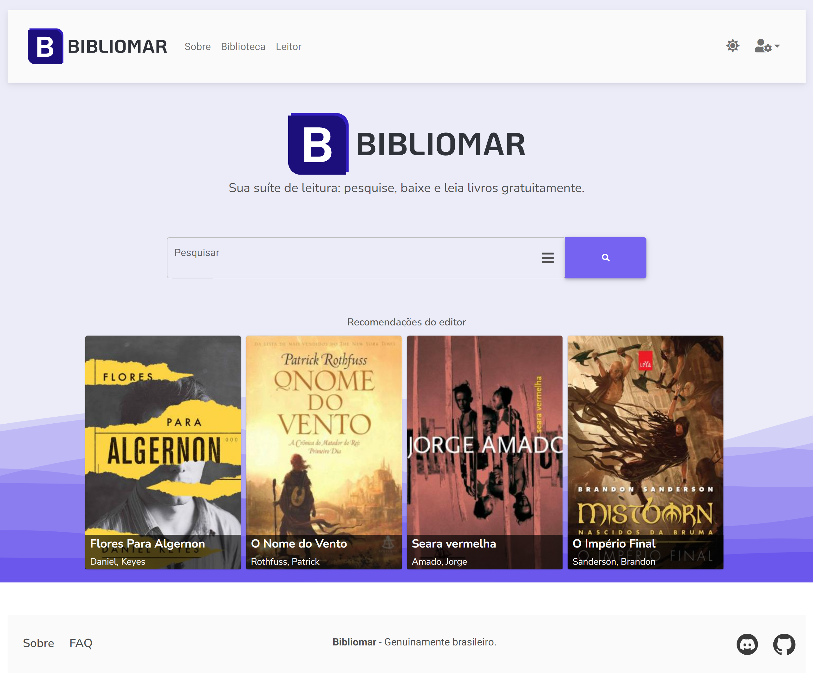

# Bibliomar

Sua suíte completa de leitura: pesquise, baixe e leia livros gratuitamente.

  

### English

## What is it?

Bibliomar is a book search engine that uses the LibraryGenesis database as a base.
The best way to understand how it works, is to simply access the [site](https://bibliomar.site).

The target audience is Brazilian, since in our country some books can reach more than 5% of the minimum salary, and the
existing alternatives on the internet force the user to wait long download queues, or simply do not have such a
robust catalog.

However, Bibliomar is fully available in English. And we also plan to support more languages down the road (we are
looking for volunteers!)

## Always evolving

Bibliomar became a big project, and will probably continue to grow.
Our goal is to make Bibliomar the definitive reading solution in Brazil (and in Portuguese-speaking countries), and the
world.

## Features

Some of the main features are:

- Search and download books in an intuitive interface.
  And that tied to the use of the huge LibraryGenesis catalog means that you will probably find what you are looking
  for.
- Our search engine is powered by [manticore-search](https://manticoresearch.com/)
  This gives us:
- Fast (and i mean it) search results.
- Search suggestions, autocomplete and highlighting of search terms.
- Full flexibility on how we build our search queries.
- Fulltext search and boolean queries.
- Massively improved human language processing (when compared to MySQL's native fulltext search).
- A library with five different categories, where you can save your books.
- A explore screen where you can find the most popular entires, and also the most recent.
- Read your books online, without the need to download an ePub reader.
  Powered by [epub-js](https://github.com/futurepress/epub.js/)
  and [react-reader](https://www.npmjs.com/package/react-reader).
  We have built a custom reader component that allows the user to customize the font size, font family, background and
  etc.
  You are free to use it in your own projects. Just copy the code
  from [here](https://github.com/bibliomar/bibliomar-client/tree/main/src/components/reader/screen)
-

### Português

## Do que se trata?

Bibliomar é um buscador de livros que usa o acervo do LibraryGenesis como base.

A melhor forma de entender como funciona, é simplesmente acessando o [site](https://bibliomar.site).

O publico alvo é brasileiro, já que em nosso país alguns livros podem chegar a custar mais de 5% do salário minímo, e as
alternativas
existentes na internet forçam o usuario a aguardar longas filas de download, ou simplesmente não possuem um acervo tão
robusto.

## Em constante evolução

O Bibliomar se tornou um projeto grande, e provavelmente vai continuar crescendo.  
Nosso objetivo é tornar o Bibliomar a solução definitiva de leitura no Brasil (e em países de lingua portuguesa), e no
mundo.

## Principais funcionalidades

Atualmente, no Bibliomar você pode:

- Pesquisar e baixar livros em uma interface intuitiva.  
  E isso atrelado ao uso do acervo gigante do LibraryGenesis significa que dificilmente você não vai achar o que
  procura.

- Salvar livros em sua biblioteca em três categorias diferentes. Estes podem ser baixados a qualquer momento e terão seu
  progresso salvo no leitor online.

- Ler seus livros online, sem a necessidade de baixar um leitor ePub ou o arquivo do livro.  
  Isso é possível graças a uma nova tecnologia que nos permite renderizar ePubs direto no navegador.  
  Além disso, o seu progresso de leitura é salvo online e sincronizado entre dispositivos.

## Como funciona?

Nós abstraimos bastante do processo durante o desenvolvimento, mas o Bibliomar pode ser considerado como um web-scraping
do LibraryGenesis, que então apresenta esses dados em uma interface mais elegante.

Existem três componentes principais para que isso seja possível:

- [grab-fork-from-libgen](https://github.com/Lamarcke/grab-fork-from-libgen)  
  Essa é a base de tudo, essa biblioteca é a responsável por fazer o web-scraping no site do LibraryGenesis, e retornar
  as informações de forma organizada.

- [Biblioterra](https://github.com/Lamarcke/Biblioterra)  
  Esse é o backend, uma API em Python, utilizando FastAPI.

- Bibliomar (aqui)  
  E esse é o frontend, que consome a API e apresenta em uma interface ao usuario final.

## Como posso contribuir?

Primeiramente, recomendamos seguir este tutorial:  
[Quero contribuir](https://github.com/Lamarcke/bibliomar-react/blob/main/IMNEW.md)  
Ele vai te guiar pelos primeiros passos para deixar seu ambiente de desenvolvimento pronto e como trabalhar no seu
primeiro issue.  
La também tem algumas dicas sobre como a aplicação funciona.

Caso você tenha mais experiencia com backend, não exite em dar uma olhada no código
do [Bibliotera](https://github.com/Lamarcke/Biblioterra).

### Principais formas de contribuição

#### Refatoramento

Esse é um projeto que passou muito tempo no forno, projetado por uma só pessoa.
E durante essas noites mal dormidas que passamos juntos, tenho de admitir que algumas partes do código podem ser
melhoradas.  
Se você encontrar alguma função, chamada a API ou tipagem errônea, não exite em abrir um issue ou PR para corrigir.

#### Tipagem

Nós estamos tentando extrair o máximo do Typescript, por isso, qualquer ajuda com a tipagem do código é muito
bem-vinda.  
Isso ajuda no desenvolvimento atual e futuro.

#### Design

Você pode sugerir mudanças no design de alguma parte do site, e os membros da comunidade vão avaliar a implementação.  
Para isso, abra um issue e descreva sua sugestão.
